<p align="center">
  
</p>

<h1 align="center">TurboGhasts & MCPD</h1>

<p align="center">
  <b>Minecraft Police Department for Happy Ghasts</b><br>
  Server-side Fabric mod &middot; Minecraft 1.21.11 &middot; Java 21
</p>

<p align="center">
  
  
  
  
</p>

---

**TurboGhasts & MCPD** (Minecraft Police Department) turns Happy Ghasts into fully registered vehicles with license plates, speed upgrades, particle trails, an impound lot, and a complete traffic police system. Think of it as a GTA vehicle registration mod, but for flying ghosts.

The entire mod is **server-side only** — no client mods required.

## How It Works

Every Happy Ghast that spawns in your world gets detected and placed on a registration watchlist. Players have a configurable time window (default: 24 hours) to register their ghast, or it gets **impounded** automatically.

### Registration Flow

When you find a ghast and Shift+RMB click on it, you're guided through a multi-step registration process:

**Step 1.** Name your ghast.

<p align="center">
  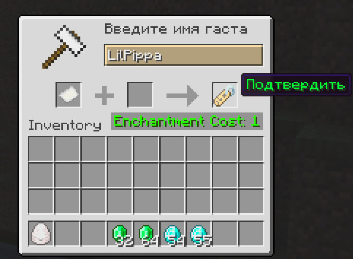
</p>

**Step 2.** Pick a harness color from all 16 Minecraft dye colors.

<p align="center">
  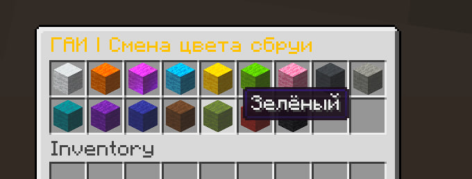
</p>

**Step 3.** Choose a license plate number from 7 randomly generated options.

<p align="center">
  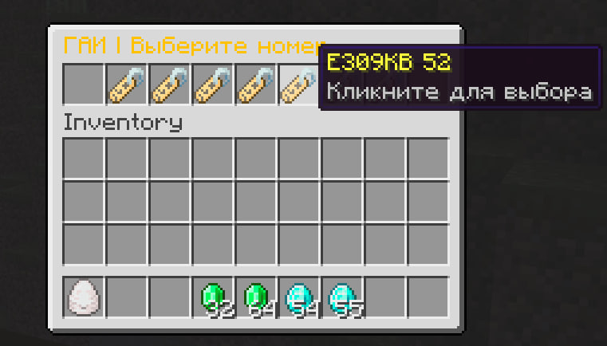
</p>

**Step 4.** Confirm payment and register.

<p align="center">
  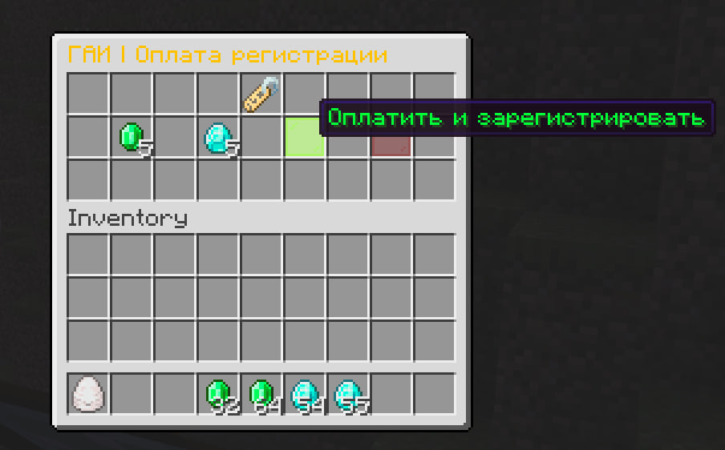
</p>

Once registered, your ghast gets physical license plates — floating text displays on the front and back:

<p align="center">
  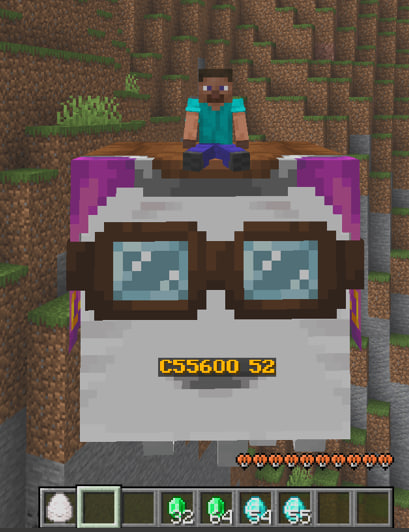
</p>

### Ghast Info Menu

Shift+RMB on a registered ghast opens the info panel. Here you can see the owner, plate number, current stage, particles, mileage, and access customization options.

<p align="center">
  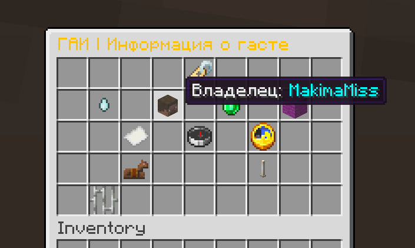
  <br>
  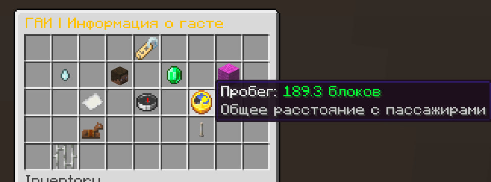
</p>

### Speed Stages

Upgrade your ghast's speed through 3 stages. Each higher stage costs more resources. Once purchased, you can freely switch between any unlocked stage at no cost.

<p align="center">
  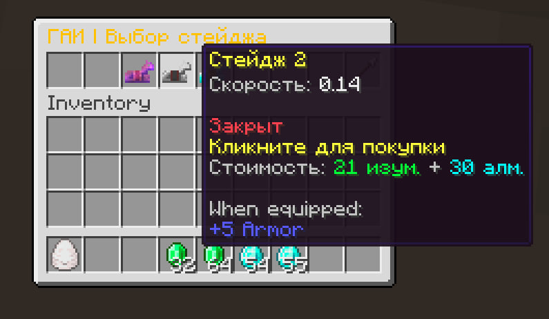
</p>

### Particle Trails

Customize your ghast with particle effects — flames, hearts, cherry blossoms, witch sparks, notes, fireflies, and color-customizable dust particles.

<p align="center">
  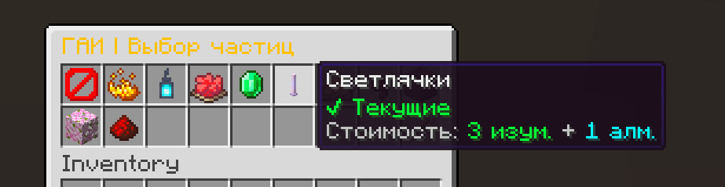
</p>

### Impound System

Ghasts that miss their registration deadline get automatically confiscated and teleported to the impound zone. Players receive a warning in chat.

<p align="center">
  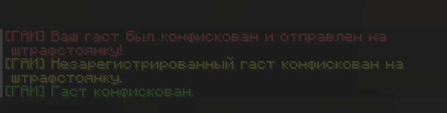
</p>

Impounded ghasts can't leave the impound zone, even when ridden. To get your ghast back, pay the release fee:

<p align="center">
  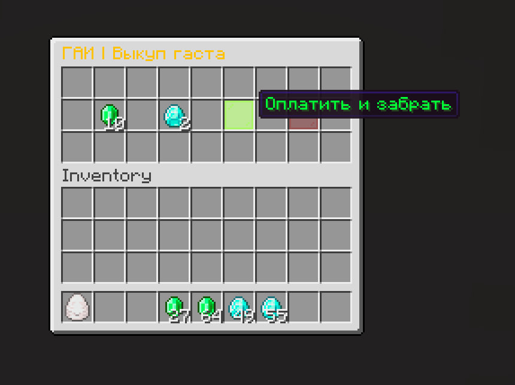
</p>

### Death & Insurance

If your ghast dies, it's permanently removed from the registry. You'll receive a condolence message and a 15% insurance refund of all invested resources (minimum 1 emerald + 1 diamond).

<p align="center">
  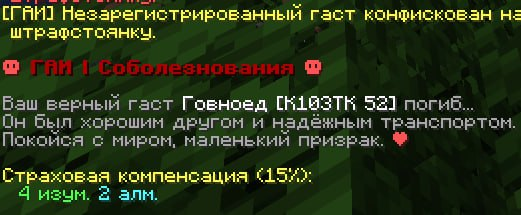
</p>

## Key Features

| Feature | Description |
|---|---|
| **Vehicle Registration** | Multi-step process: name, harness color, license plate selection, payment |
| **License Plates** | Physical floating TextDisplay entities on front and back of the ghast |
| **Speed Stages** | 3 tiers of speed upgrades, freely switchable once purchased |
| **Particle Trails** | 7+ particle types including color-customizable dust |
| **Impound Lot** | Auto-confiscation of unregistered ghasts with containment zone |
| **Teleport** | `/gai tp` to summon your ghast from anywhere |
| **Mileage Tracking** | Block distance counter while riding |
| **Death Insurance** | 15% resource refund on ghast death |
| **Menu Locking** | Ghast freezes during menu interaction; single-editor lock with admin priority |
| **Server Stats** | Admin GUI showing total resource transactions across the server |
| **Fully Configurable** | All costs, timers, and zones are adjustable via in-game admin GUI |

## Installation

1. Install [Fabric Loader](https://fabricmc.net/) for Minecraft 1.21.11
2. Install [Fabric API](https://modrinth.com/mod/fabric-api)
3. Drop the `turboghasts-mcpd-1.0.11.jar` into your server's `mods/` folder
4. Start the server — no client-side installation needed

## Building from Source

```bash
git clone https://github.com/Ar4ikov/turboghasts-mcpd.git
cd turboghasts-mcpd
./gradlew build
```

The compiled JAR will be in `build/libs/`.

### Requirements

- Java 21+
- Gradle 9.x (wrapper included)

## Dependencies

| Dependency | Version | Bundled |
|---|---|---|
| Fabric API | 0.141.3+1.21.11 | No |
| [SGUI](https://github.com/Patbox/sgui) | 1.12.0+1.21.11 | Yes (JiJ) |

## Documentation

For detailed documentation on all commands, admin configuration, and system behavior, see the **[Wiki](docs/)**.

- [Commands Reference](docs/commands.md)
- [Admin Configuration](docs/admin-config.md)
- [Registration System](docs/registration.md)
- [Impound System](docs/impound.md)

## Project Structure

```
src/main/java/com/happyghast/gai/
├── command/          # Brigadier command registration
├── config/           # GaiConfig — all costs, timers, zones, transaction stats
├── data/             # GhastVehicleData, GhastRegistryState, PlateGenerator
├── gui/              # All server-side GUIs (sgui library)
├── handler/          # Event handlers (tick, interaction, death, tracking)
├── plate/            # License plate TextDisplay management
└── zone/             # Impound zone logic
```

## License

This project is licensed under the MIT License. See [LICENSE](LICENSE) for details.

## Author

**Nikita Davidchuk** ([@Ar4ikov](https://github.com/Ar4ikov))
bizy18588@gmail.com
